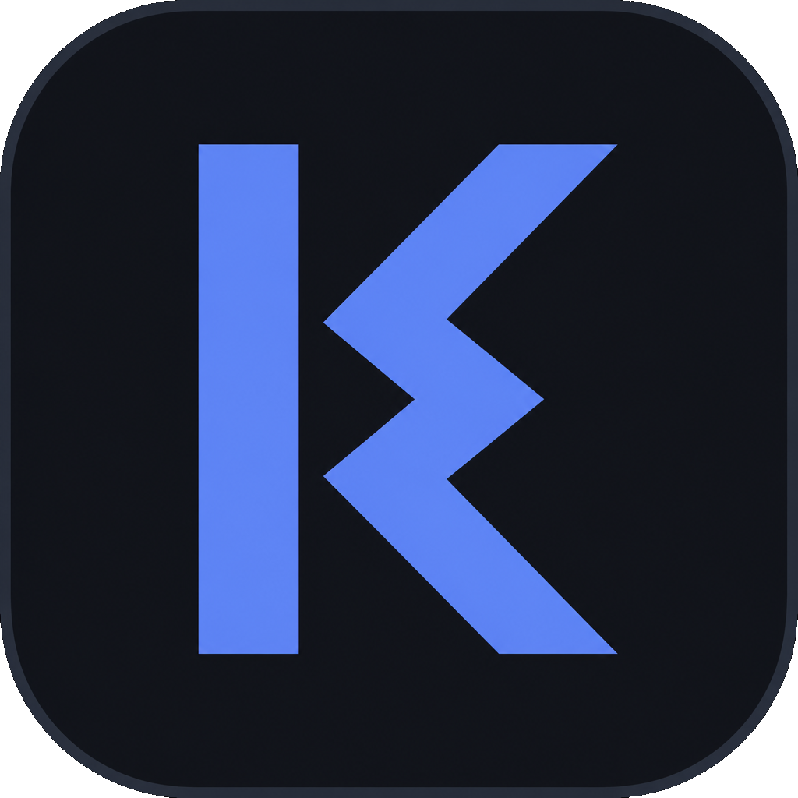

# KermoLauncher



Personal game launcher. The catalog lives on a **public Nextcloud share**; the app installs, updates, and launches games, and tracks playtime.

**Download:** [kermo.dev](https://kermo.dev) · [GitHub Releases](https://github.com/Kermo27/KermoLauncher/releases/latest)

The repo also includes **KermoLauncher Admin Tool** (Windows) — scan a test games folder, generate `manifest.json` / `metadata.json`, then copy only the SHA-256 delta into the Nextcloud-synced `Games` folder. The desktop client uploads it; the launcher’s public share stays as it is.

## Features

- Game library from a public Nextcloud link (`metadata.json`)
- Game cards with cover art (first image from `screenshots/`), install status, tags and filtering
- Install with SHA-256 verification, per-file delta updates, parallel downloads, pause and resume
- Playtime tracking and last-launched date
- Windows games on Linux through Proton (Wine as a fallback), including Online-Fix
- Themes: light, dark, system — UI in Polish or English
- Launcher self-update from GitHub Releases
- Admin Tool: compare the test folder to the synced library by hash, then copy added/changed files and delete removed ones

## Project structure

```
KermoLauncher/
├── GameLauncher.Core/        # WebDAV, download, install, SQLite, Proton, updates
├── GameLauncher.UI/          # launcher (Avalonia)
├── GameLauncher.UI.Shared/   # shared Avalonia bits used by the launcher and Admin Tool
├── GameLauncher.AdminTool/   # publisher (Avalonia, Windows)
├── GameLauncher.Tests/
├── docs/                     # kermo.dev (GitHub Pages)
├── packaging/linux/          # .desktop, icon, install.sh
└── GameLauncher.sln
```

## Requirements

- .NET 8 SDK (to build)
- Windows 10/11 or Linux x64 (to run)

## Building

```bash
dotnet build -c Release
```

To produce a single-file self-contained build (`win-x64` or `linux-x64`):

```bash
dotnet publish GameLauncher.UI -c Release -r linux-x64 --self-contained -p:PublishSingleFile=true
```

Single-file publishing bundles the native libraries (Skia, HarfBuzz, SQLite) inside the
executable, so the result is one file with no loose `.so`/`.dll` next to it. The launcher's
self-update relies on that: it replaces exactly one file.

## Website

[kermo.dev](https://kermo.dev) is the static page in [`docs/`](docs/), served by **GitHub Pages**
(`Settings → Pages → Deploy from a branch → main / docs`, custom domain in `docs/CNAME`).
Download buttons resolve the latest GitHub Release at load time, so a new tag does not require
editing the page. The page is Polish by default, with an EN toggle.

## Releases

Pushing a `v*` tag runs [`.github/workflows/release.yml`](.github/workflows/release.yml), which
builds both platforms, derives the version from the tag, and publishes:

- `KermoLauncher-<version>-win-x64.exe`
- `KermoLauncher-<version>-linux-x64.tar.gz` — binary + `.desktop` + icon + `install.sh`
- `KermoLauncher-<version>-linux-x64` — plain binary for in-app updates (`chmod +x` after a
  manual download; GitHub release assets carry no file permissions)
- `KermoLauncher.AdminTool-<version>-win-x64.zip`
- `SHA256SUMS` — verified by the launcher before it installs an update

The workflow can also be run manually (**Run workflow**) to build the assets without creating a
release. Two constraints keep older installs able to update: the Windows asset must stay a single
`.exe`, and no other `.exe` may be added to a release, because clients before 1.0.6 pick the first
matching file they find.

### Linux install

Download `KermoLauncher-<version>-linux-x64.tar.gz`, extract it, then:

```bash
./install.sh ./KermoLauncher
```

That places the binary in `~/.local/bin/kermolauncher` (user-writable, so self-update works), a
desktop entry under `~/.local/share/applications/`, and the icon under
`~/.local/share/icons/hicolor/256x256/apps/`. You can also run the plain
`KermoLauncher-<version>-linux-x64` binary directly.

Windows games launch through **Proton** by default on Linux (Settings → Windows games):
`umu-run` when available, otherwise Steam Runtime + `proton run` (runtime taken from Proton’s
`toolmanifest.vdf`). Install GE-Proton under Steam’s `compatibilitytools.d`. Wine remains a
selectable fallback. When `OnlineFix.ini` / `OnlineFix*.dll` is present, the launcher sets the
usual `WINEDLLOVERRIDES` and SpaceWar (`480`) game id automatically and skips umu (same idea as
online-fix / SOFL). Steam should be running for online-fix multiplayer. `protontricks` remains
for prefix tooling (VC++, .NET), not launch.

## Nextcloud library layout

```
<shared folder>/
├── metadata.json
└── <Game Name>/
    ├── game files...           (any files/subfolders)
    ├── manifest.json           (generated by the Admin Tool)
    └── screenshots/
        ├── 1.jpg
        └── 2.png
```

Each game is a subfolder containing the raw game files. The Admin Tool generates a `manifest.json`
per game (list of files with sizes and SHA-256 hashes, total size, version) and a catalog
`metadata.json` that references it. Everything except `screenshots/` and `manifest.json` counts as
game content.

`metadata.json` format (generated by the Admin Tool):

```json
[
  {
    "id": "shift-at-midnight",
    "name": "Shift At Midnight",
    "version": "1.1.0",
    "description": "...",
    "tags": ["adventure", "pixel art"],
    "dependencies": [],
    "screenshotUrls": ["Shift At Midnight/screenshots/1.jpg"],
    "manifestUrl": "Shift At Midnight/manifest.json",
    "sizeBytes": 123456789,
    "launchConfig": {
      "executablePath": "game",
      "workingDirectory": null,
      "launchArgs": null
    }
  }
]
```

Per-game `manifest.json`:

```json
{
  "version": "1.1.0",
  "totalBytes": 123456789,
  "files": [
    { "path": "game", "sizeBytes": 123456000, "sha256": "..." },
    { "path": "data/level.dat", "sizeBytes": 789, "sha256": "..." }
  ]
}
```

When installing, the launcher downloads only files that changed since the last installed manifest
(delta update) and verifies every downloaded file against its SHA-256 checksum. The Admin Tool
skips copying files that already match in the destination folder (same SHA-256).

## Setup from a share link

1. In the Admin Tool **Game editor**, scan the folder where you test games (not the Nextcloud copy)
   and generate `manifest.json` / `metadata.json`.
2. On the **Publish** tab, pick the synced library folder (usually `~/Nextcloud/Games`), **Compare**,
   then copy the delta. Nextcloud desktop uploads it; keep an existing **public link** on that folder.
3. In the launcher: **Settings → Game source (Nextcloud)** — paste the share link and save.
4. Go back to **Library** and click **Refresh**.

## App data

Settings, library and install state are stored in SQLite:

- Windows: `%LOCALAPPDATA%\KermoLauncher\launcher.db` (migration from the legacy `GameLauncher` path happens automatically)
- Linux: `~/.local/share/KermoLauncher/launcher.db`

The Nextcloud share link lives only in that database — it is never part of the repo or a build.

## License

This project is released into the public domain under the [Unlicense](LICENSE).
